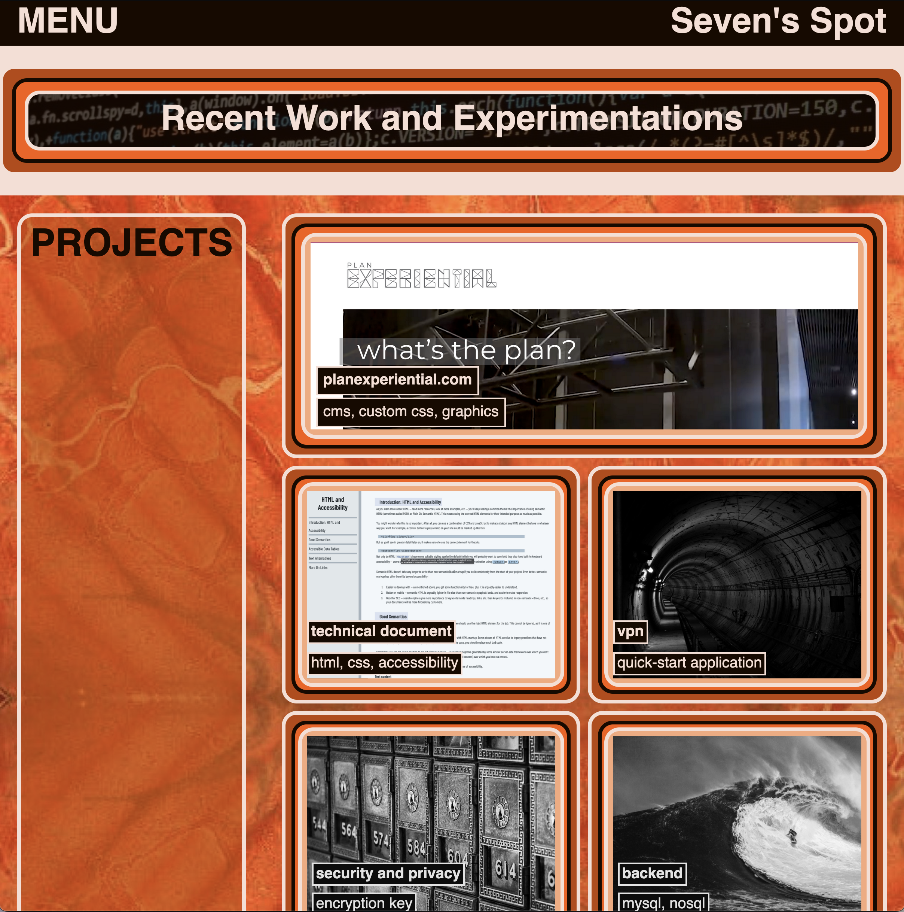

# Second Week Challenge -- My Portfolio
UofO Bootcamp 2nd Week Challenge Exercise

## Usage

This web page is the intended superstructure for what will become my **Work Portfolio**. It contains actual and placeholder samples of my *Projects*, an *About Me* section, and *Contact Infomation*.

## Mockup

## Links

<a href="https://github.com/SevenRooT/02_Challenge-MyPortfolio" target="_blank">GitHub Repository</a>

<a href="https://sevenroot.github.io/02_Challenge-MyPortfolio/" target="_blank">Seven's Spot</a>

## License

[MIT](https://choosealicense.com/licenses/mit/)
